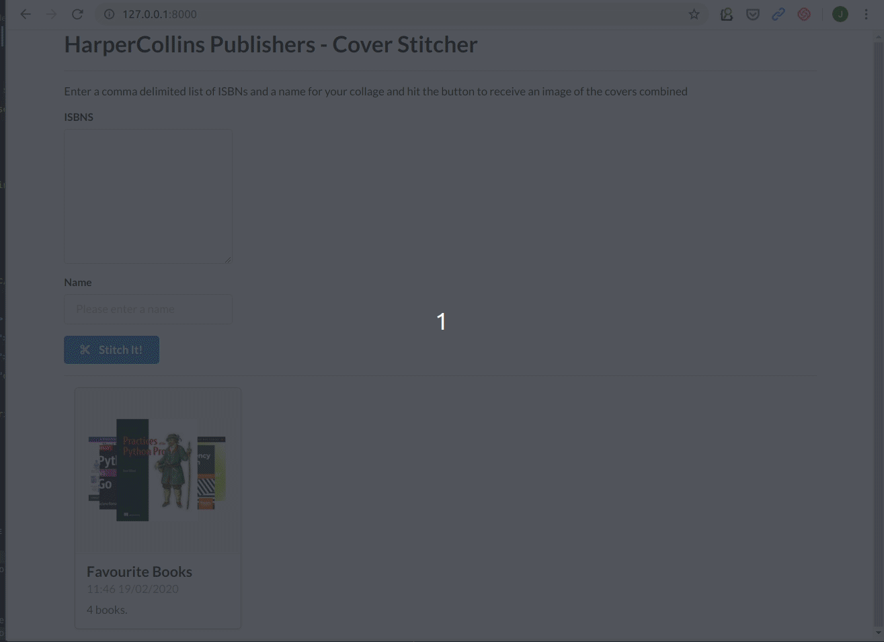

# README #

This is a short assessment designed to give you an idea of what a full stack developer at HarperCollins will be doing.

You may spend a few hours completing this Django-based assignment.

The details of the assignment and instructions for submission are listed below.

Certain building blocks for creating the app have already been provided for you. This is covered below.

Thank-you for your interest, and we look forward to discussing this with you.

## Prerequisites ##
Python **3.x**

## Assignment Detail ##

'Cover Stitcher' is a web app that allows users to create and download collages of book covers.

The app backend uses Django and the frontend has a form to  allow the user to enter the following for submission to the server.

* a search input containing a list of unique book IDs (['ISBNs'](https://en.wikipedia.org/wiki/International_Standard_Book_Number)) 
* a name (eg. Favourite Programming Books)

On the backend, use the [Open Library Covers API](https://openlibrary.org/dev/docs/api/covers) to download book covers to the server and use a Python image processing library to create the collage.

When this is complete, the frontend receives a URL to the created collage, and the page is updated.

## Frontend? Building blocks already provided ##

Frontend assets for styling and the majority of the JS are is done.

The search input has some ISBNs prepopulated.

## Instructions for sending us your code ##

Please fork this repo, add your code and commit, and send us the URL.

## Tips ##

* You should use Python to generate a thumbnail comprising the downloaded images. The resulting thumbnail may arrange the constituent images in a tiled pressentation as shown below, or extra points for the fancy arranagement in the preview GIF. :)

    

* We are interested to understand your approach and design considerations. and welcome well-commented readable pseudo-code if time is running out. How would you enhance this app, and what features would you add?

* Remember to break down the assignment into manageable tasks.

* It may help to use the Python REPL or a Jupyter notebook to get the backend logic decided before delving into Django or the Frontend.

